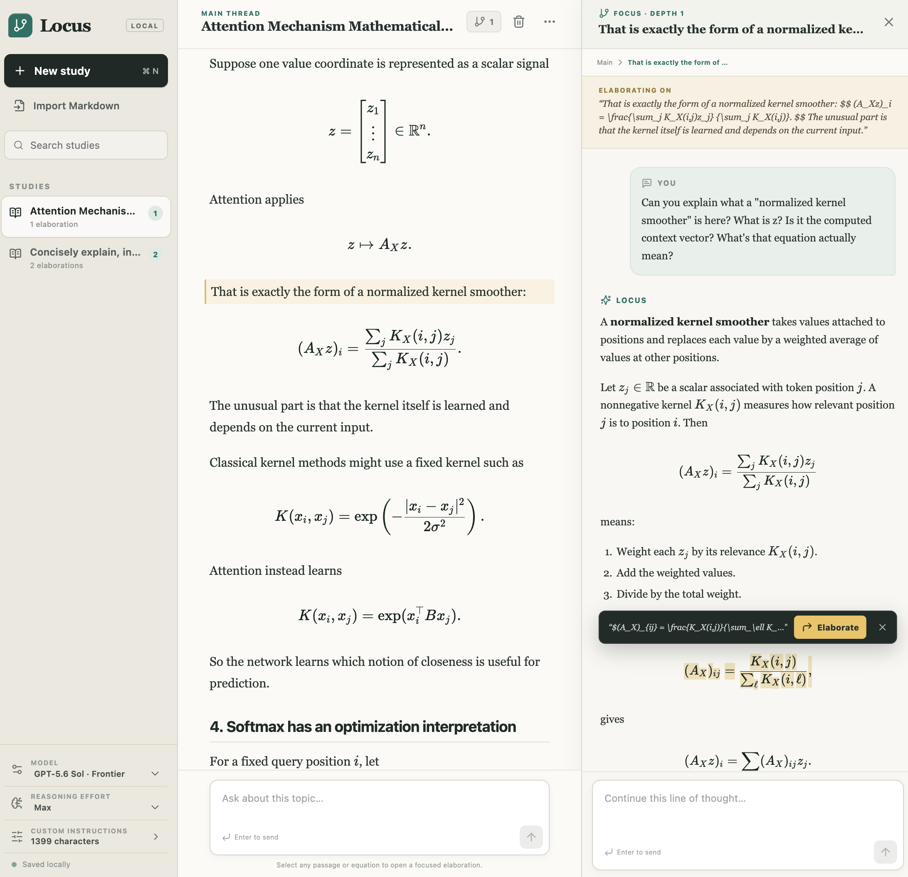

# Locus

A local-first chat UI for studying difficult technical material without blowing up every conversation into a mess of unorganized follow ups / clarifications.



## How to use / What this does

- Select any rendered passage or equation and choose **Elaborate**.
- The focused drawer receives the complete ancestor context, the exact selection, and your
  elaboration request.
- Repeat the same action inside a focused thread to create arbitrarily deep branches.
- Prior elaborations stay attached to their source passage; click anywhere in the marked
  source block to reopen the branch.
- Stream model responses into the thread as they are generated.
- Add optional custom instructions that supplement the built-in tutoring prompt.
- Paste Markdown (including LaTeX) into a new study without making a model request.
- Recover LaTeX from ChatGPT rendered-copy imports where `\[` / `\(` delimiters were
  flattened into plain brackets and parentheses.
- Render fenced code blocks with language-aware syntax highlighting.
- Store the complete workspace as a readable local JSON document in `data/chats.json`.

## Run it

Requirements: Node.js 20+ and add an `OPENAI_API_KEY.txt` file in this directory.

```bash
npm install
npm run dev
```

Open [http://127.0.0.1:5173](http://127.0.0.1:5173). The web app runs on port 5173 and
proxies API requests to the local server on port 8787.

For a production-style local run:

```bash
npm run build
npm start
```

Then open [http://127.0.0.1:8787](http://127.0.0.1:8787).

## Architecture

- `src/App.tsx` owns workspace and recursive-thread state.
- `src/components/MarkdownMessage.tsx` renders Markdown, KaTeX, and code; captures selections
  using original TeX source; and reconnects saved anchors to rendered passages.
- `src/lib/tree.ts` contains the small set of tree and context helpers.
- `server/openai.ts` is the only code that reads the API key and calls the Responses API.
- `server/storage.ts` persists one versioned JSON document using atomic replacement.

Threads are stored as a flat map with `parentId` links. That keeps updates cheap while
preserving an ordinary tree: walking parent links produces the exact context path supplied
to the model.

## Notes

- The server binds to `127.0.0.1` by default so the API key is not exposed on the LAN.
- The default model is `gpt-5.6-sol` with `max` reasoning effort. Both model and reasoning
  effort are configurable in the sidebar.
- Custom instructions are stored locally with the workspace and appended to, rather than
  substituted for, the built-in tutoring instructions.
- Set `PORT` or `HOST` when starting the server if you need different local bindings.
